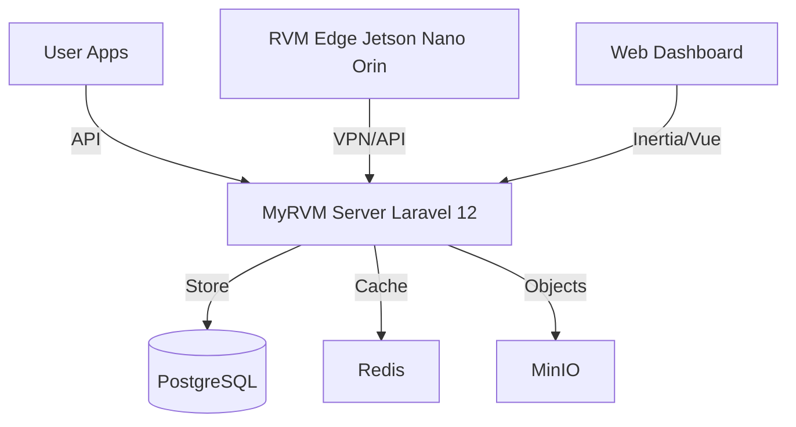

# ♻️ MyRVM Project - Reverse Vending Machine System v1.0


> **Modern, Scalable, and Secure Reverse Vending Machine Ecosystem**
> *Providing AI-driven waste management solutions with real-time telemetry and robust economy systems.*

---

## 📖 Project Overview

**MyRVM (Reverse Vending Machine)** adalah ekosistem komprehensif yang mengintegrasikan perangkat keras RVM (Edge AI), backend server yang kuat, dan aplikasi pengguna untuk memfasilitasi daur ulang sampah botol plastik/kaleng secara cerdas. Sistem ini menggunakan teknologi **Computer Vision (YOLO11 + SAM2)** untuk deteksi objek secara real-time dan **Tailscale VPN** untuk komunikasi jaringan yang aman antar perangkat.

### ✨ Key Features
- **🤖 AI-Powered Detection:** Integrasi Computer Vision untuk identifikasi botol/kaleng akurat.
- **🔐 Secure Networking:** Komunikasi antar RVM-Edge dan Server via Private VPN (Tailscale).
- **💸 Economy System:** Manajemen poin, voucher, dan transaksi user secara real-time.
- **📊 Real-time Telemetry:** Monitoring kesehatan perangkat (Heartbeat, Logs, Status).
- **📱 Multi-Platform Support:** Backend siap untuk Mobile Apps (User/Tenant) dan Web Dashboard.

---

## 📂 Repository Structure

Repositori ini terdiri dari beberapa komponen utama:

### 1. [🖥️ MyRVM-Server](./MyRVM-Server)
Backend utama sistem yang dibangun menggunakan **Laravel 10**.
- **Path:** `./MyRVM-Server`
- **Fungsi:**
    - RESTful API (Authentication, Transaction, Redemption).
    - Web Dashboard untuk Admin/Operator.
    - WebSocket Server (Laravel Reverb) untuk komunikasi real-time.
    - Database Management (PostgreSQL).
- **Dokumentasi API:** Tersedia via Swagger UI di `/api/documentation`.

### 2. [📚 Docs (Dokumentasi Proyek)](./Docs)
Pusat informasi teknis dan manajerial proyek.
- **Path:** `./Docs`
- **Isi:**
    - **Overview:** Arsitektur sistem, topologi jaringan, dan alur kerja.
    - **Plan:** Roadmap pengembangan, rencana integrasi API, dan strategi testing.
    - **Changelog:** Catatan perubahan dan status proyek.
    - **Concept:** Penjelasan konsep RVM v2 dan modernisasi backend.

---

## 🚀 Quick Start Guide

### Prerequisites
- PHP 8.1+
- Composer
- PostgreSQL
- Node.js & NPM

### Installation (Server)

1.  **Clone Repository:**
    ```bash
    git clone https://github.com/ngajar-feri/MyRVM1.git
    cd MyRVM1/MyRVM-Server
    ```

2.  **Install Dependencies:**
    ```bash
    composer install
    npm install
    ```

3.  **Environment Setup:**
    ```bash
    cp .env.example .env
    # Konfigurasi DB_*, SANCTUM_*, APP_URL di .env
    php artisan key:generate
    ```

4.  **Database & Seeding:**
    ```bash
    php artisan migrate --seed
    ```
    *(Default credentials tersedia di `MyRVM-Server/README.md`)*

5.  **Run Application:**
    ```bash
    php artisan serve
    npm run dev
    ```

---

## 🏗️ System Architecture



---

## 🔐 Credentials (Demo)

| Role | Email | Password |
| :--- | :--- | :--- |
| **Super Admin** | `superadmin@myrvm.com` | `password123` |
| **Admin** | `admin@myrvm.com` | `password123` |
| **Operator** | `operator@myrvm.com` | `password123` |
| **Technician** | `tech@myrvm.com` | `password123` |
| **User** | `john@example.com` | `password123` |

---

## 📞 Contact & Support

Project ini dikembangkan untuk tujuan edukasi dan implementasi sistem RVM modern.
Untuk pertanyaan teknis, silakan lihat folder [Docs](./Docs) atau hubungi tim pengembang.

---
*© 2026 MyRVM Project. All Rights Reserved.*
